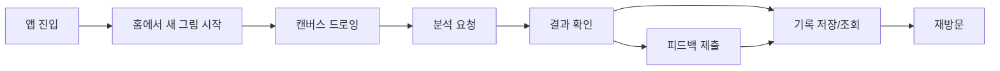
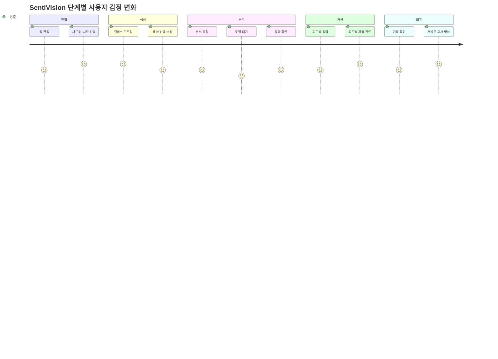
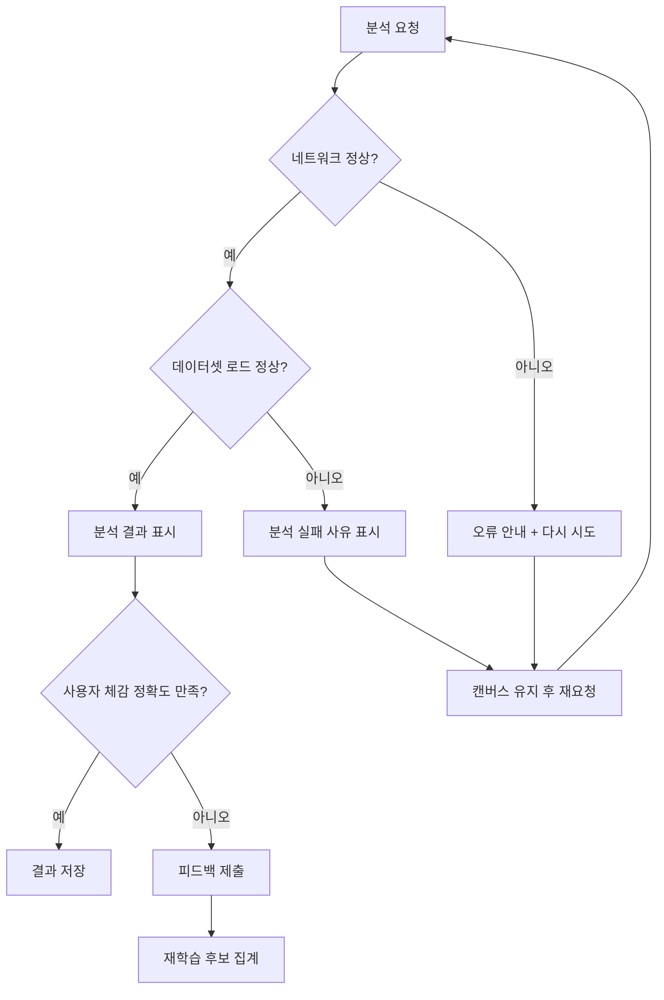
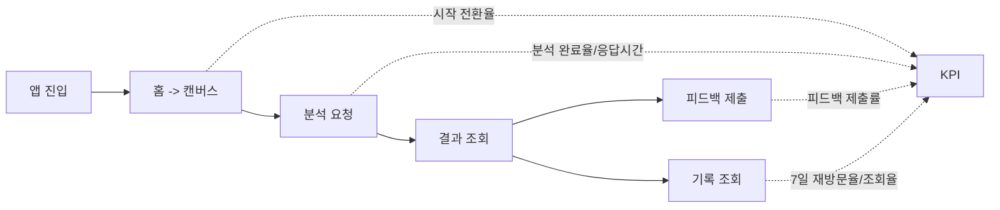

# 사용자 여정 시나리오: SentiVision

작성일: 2026-03-13  
문서 버전: v1.0

## 1. 문서 목적
이 문서는 SentiVision 사용자가 앱을 처음 접한 순간부터 감정 분석 결과 확인, 피드백 제출, 재방문까지의 전체 여정을 시나리오 형태로 정의한다.

## 2. 사용자 페르소나
- 이름: 민준 (가상 사용자)
- 연령: 23세
- 특징: 감정 표현이 서툴지만 그림 그리기를 좋아함
- 목표: 오늘 자신의 감정 상태를 가볍게 확인하고 기록하고 싶음

## 3. 핵심 사용자 여정

### 단계 1. 앱 진입
- 사용자 목표: 앱이 무엇을 하는지 빠르게 이해하기
- 사용자 행동: 앱 실행 후 홈 화면 확인, "새 그림 시작" 버튼 선택
- 시스템 반응: 서비스 소개 문구와 최근 분석 요약 제공
- 사용자 감정: 기대감, 약간의 호기심
- 잠재 문제: 첫 화면 정보가 길면 이탈 가능
- 개선 포인트: 핵심 가치 1줄 + 즉시 시작 버튼 강조

### 단계 2. 그림 작성
- 사용자 목표: 현재 기분을 색으로 표현하기
- 사용자 행동: 캔버스에서 색상 선택 후 드로잉
- 시스템 반응: 선택 색상 및 대표 팔레트 미리보기 제공
- 사용자 감정: 몰입, 창의성
- 잠재 문제: 도구가 복잡하면 피로감 증가
- 개선 포인트: 기본 도구 단순화, 되돌리기 버튼 가시성 강화

### 단계 3. 감정 분석 요청
- 사용자 목표: 내 그림의 감정 결과 확인하기
- 사용자 행동: "분석하기" 버튼 탭
- 시스템 반응: 분석 로딩 표시 후 결과 화면 이동
- 사용자 감정: 긴장감, 기대감
- 잠재 문제: 로딩이 길면 불안/이탈 발생
- 개선 포인트: 단계형 로딩 메시지(색상 추출 중, 점수 계산 중) 제공

### 단계 4. 결과 확인
- 사용자 목표: 예측 감정과 이유(점수)를 이해하기
- 사용자 행동: 예측 감정 배지, 점수 그래프, 대표 색상 확인
- 시스템 반응: 감정별 confidence score와 대표 팔레트 시각화 제공
- 사용자 감정: 수용 또는 의문
- 잠재 문제: 결과 근거가 약하면 신뢰 하락
- 개선 포인트: 상위 3개 감정 점수 및 대표 색상과의 연결 설명 제공

### 단계 5. 피드백 제출
- 사용자 목표: 예측이 틀렸으면 정정하기
- 사용자 행동: 실제 감정 선택, 선택 메모 입력, 제출
- 시스템 반응: 피드백 저장 완료 메시지 표시
- 사용자 감정: 참여감, 기여감
- 잠재 문제: 입력 과정이 번거로우면 제출 포기
- 개선 포인트: 원탭 선택 + 메모 선택 입력(필수 아님)

### 단계 6. 기록 확인 및 재방문
- 사용자 목표: 과거 감정 흐름 확인하기
- 사용자 행동: 히스토리 화면에서 날짜별 결과 조회
- 시스템 반응: 예측/수정 감정과 대표 색상 로그 표시
- 사용자 감정: 자기 이해 강화
- 잠재 문제: 기록 탐색이 불편하면 재방문 저하
- 개선 포인트: 주간/월간 필터, 최근 7일 요약 카드 제공

## 4. 대표 시나리오 (Happy Path)
1. 사용자는 앱 실행 후 새 그림 시작을 누른다.
2. 캔버스에 주황/하늘색 중심으로 그림을 그린다.
3. 분석하기를 누르면 2초 내 결과가 표시된다.
4. 예측 감정(예: energy)과 점수 분포를 확인한다.
5. 예측이 맞아 결과를 저장하고 종료한다.

## 5. 예외 시나리오 (Edge Cases)

### E1. 네트워크 오류
- 상황: 분석 요청 중 네트워크 불안정
- 기대 동작: 오류 메시지 + 다시 시도 버튼 제공
- 대체 경로: 캔버스 데이터 유지 후 재요청

### E2. 데이터셋 로드 실패
- 상황: 서버 데이터 파일 누락 또는 접근 실패
- 기대 동작: 분석 실패 사유 표시, 관리자 확인 필요 로그 기록
- 대체 경로: 서버 health는 유지하되 analyze에서 명확한 에러 반환

### E3. 예측 불일치 빈발
- 상황: 사용자가 반복적으로 결과를 정정
- 기대 동작: 피드백 수집 강화, 모델 재학습 후보로 자동 집계
- 대체 경로: 자주 수정되는 감정 매핑에 우선 개선 태그 부여

## 6. 여정별 KPI 연결
- 단계 1~2: 시작 전환율(홈 -> 캔버스 진입률)
- 단계 3~4: 분석 완료율, 평균 응답시간
- 단계 5: 피드백 제출률
- 단계 6: 7일 재방문율, 기록 조회율

## 7. 수용 기준
- 핵심 여정(앱 진입 -> 드로잉 -> 분석 -> 결과 확인 -> 피드백)이 중단 없이 동작한다.
- 예외 상황(네트워크/분석 실패)에서 사용자 안내와 재시도 경로가 제공된다.
- KPI 측정을 위한 이벤트 지점(분석 요청, 결과 조회, 피드백 제출)이 정의된다.

---

## 8. 시각자료 버전 (Mermaid)

### 8.1 End-to-End 사용자 여정

### 8.2 단계별 감정 곡선

### 8.3 예외 시나리오 분기

### 8.4 KPI 맵핑 다이어그램

