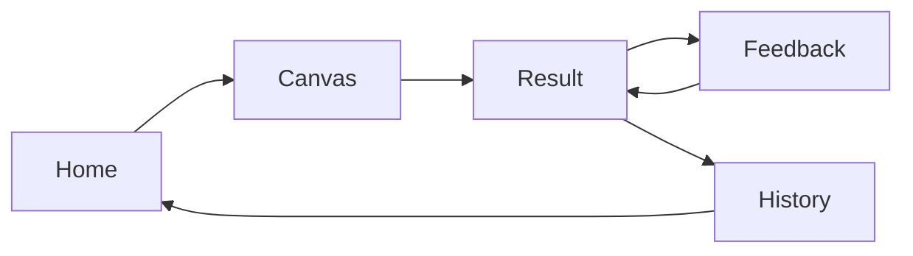
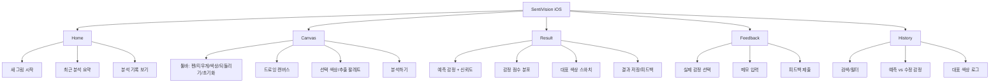
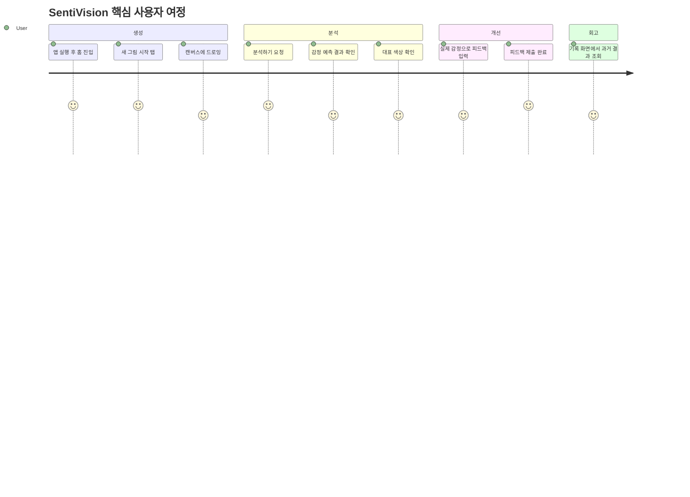
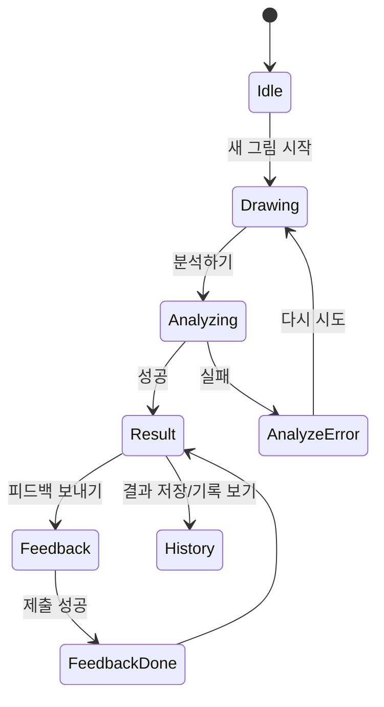

# Wireframe: SentiVision (iOS)

작성일: 2026-03-13  
문서 버전: v1.0

## 1. 화면 구조 개요

핵심 플로우
1. 홈
2. 드로잉 캔버스
3. 분석 결과
4. 피드백 입력
5. 기록(히스토리)

내비게이션
- 홈 -> 드로잉
- 드로잉 -> 분석 결과
- 분석 결과 -> 피드백
- 분석 결과 -> 기록

---

## 2. 와이어프레임 (Low-Fidelity)

### Screen A. 홈 (Home)

```text
+------------------------------------------------+
| SentiVision                                    |
| 당신의 색으로 감정을 읽습니다                  |
+------------------------------------------------+
| [ 새 그림 시작 ]                               |
|                                                |
| 최근 분석 요약                                 |
| - 마지막 감정: calmness                        |
| - 최근 7일 분석 수: 12                         |
|                                                |
| [ 분석 기록 보기 ]                              |
+------------------------------------------------+
| Home                      History              |
+------------------------------------------------+
```

요소
- CTA 버튼: 새 그림 시작
- 최근 분석 카드
- 기록 이동 버튼

---

### Screen B. 드로잉 캔버스 (Canvas)

```text
+------------------------------------------------+
| < 뒤로가기                    SentiVision       |
+------------------------------------------------+
| 도구: [펜] [지우개] [색상] [되돌리기] [초기화] |
+------------------------------------------------+
|                                                |
|                 Drawing Canvas                 |
|                                                |
|                                                |
|                                                |
|                                                |
+------------------------------------------------+
| 선택 색상: #FF8C00                             |
| 추출 팔레트: [#FF8C00] [#87CEEB] [#139611]     |
+------------------------------------------------+
| [ 분석하기 ]                                    |
+------------------------------------------------+
```

요소
- 상단 도구 바
- 중앙 대형 캔버스
- 하단 대표 색상 미리보기
- 분석 요청 버튼

---

### Screen C. 분석 결과 (Result)

```text
+------------------------------------------------+
| < 캔버스로                    분석 결과         |
+------------------------------------------------+
| 예측 감정                                        |
| [ ENERGY ]   신뢰도: 0.62                       |
+------------------------------------------------+
| 감정 점수 분포                                   |
| ENERGY      [##########----] 0.62              |
| CALMNESS    [#######-------] 0.38              |
| HARMONY     [###-----------] 0.17              |
+------------------------------------------------+
| 대표 색상                                        |
| [#FF2400] [#87CEEB] [#139611]                  |
+------------------------------------------------+
| [ 결과 저장 ]   [ 피드백 보내기 ]               |
+------------------------------------------------+
```

요소
- 예측 감정 배지
- 감정별 점수 바 차트
- 대표 색상 스와치
- 저장/피드백 액션

---

### Screen D. 피드백 입력 (Feedback)

```text
+------------------------------------------------+
| < 결과로                     피드백             |
+------------------------------------------------+
| 시스템 예측: ENERGY                             |
|                                                |
| 실제 감정 선택                                  |
| ( ) calmness   ( ) energy   ( ) sadness        |
| ( ) harmony    ( ) anxiety  ( ) other          |
|                                                |
| 메모(선택)                                      |
| +--------------------------------------------+ |
| | 예: 오늘 컨디션이 좋아서 밝은 색을 사용함  | |
| +--------------------------------------------+ |
+------------------------------------------------+
| [ 피드백 제출 ]                                 |
+------------------------------------------------+
```

요소
- 예측값 표시
- 정답 감정 선택(라디오)
- 선택 메모 입력
- 제출 버튼

---

### Screen E. 분석 기록 (History)

```text
+------------------------------------------------+
| < 홈으로                    분석 기록           |
+------------------------------------------------+
| [ 검색 ] [ 필터: 전체/주간/월간 ]              |
+------------------------------------------------+
| 2026-03-13 14:20                               |
| 예측: ENERGY / 수정: CALMNESS                 |
| 대표색: #FF2400 #87CEEB                        |
+------------------------------------------------+
| 2026-03-12 21:03                               |
| 예측: HARMONY / 수정: HARMONY                 |
| 대표색: #139611 #90EE90                        |
+------------------------------------------------+
| 2026-03-11 09:50                               |
| 예측: SADNESS / 수정: SADNESS                 |
| 대표색: #2F2F2F #191970                        |
+------------------------------------------------+
```

요소
- 분석 이력 리스트
- 예측/수정 감정 비교
- 대표 색상 로그

---

## 3. 상태/예외 화면

### E1. 분석 로딩 상태
```text
[ 분석 중... ]
- 색상 추출 중
- 감정 점수 계산 중
```

### E2. 분석 실패 상태
```text
분석에 실패했습니다.
원인: 네트워크 오류 또는 데이터셋 로드 실패
[ 다시 시도 ] [ 캔버스로 돌아가기 ]
```

### E3. 피드백 제출 완료
```text
피드백이 저장되었습니다.
모델 개선에 반영됩니다.
[ 결과로 돌아가기 ] [ 홈으로 ]
```

---

## 4. API 연결 포인트
- 분석 버튼 -> POST /analyze
- 피드백 제출 -> POST /feedback
- 헬스 체크(앱 시작 시 선택) -> GET /health

---

## 5. MVP 우선순위
P0
- 홈, 캔버스, 분석 결과, 피드백
- /analyze, /feedback 연동

P1
- 기록 화면
- 필터/검색

P2
- 감정 시각화 고도화(상세 차트)
- 개인화 추천 메시지

---

## 6. 시각자료 버전 (Mermaid)

아래 다이어그램은 PRD/WBS 공유 문서나 발표 자료에 바로 붙여 넣을 수 있는 시각화 버전입니다.

### 6.1 화면 전환 플로우



### 6.2 정보 구조 (IA)



### 6.3 핵심 사용자 여정



### 6.4 상태/예외 플로우


